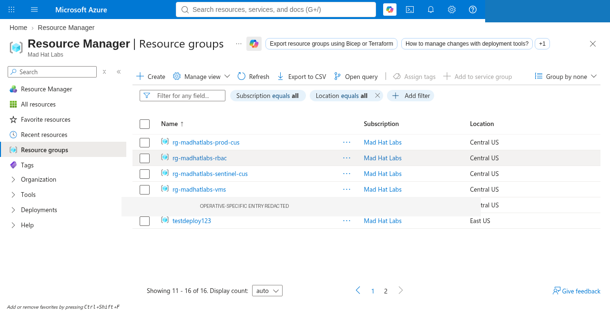
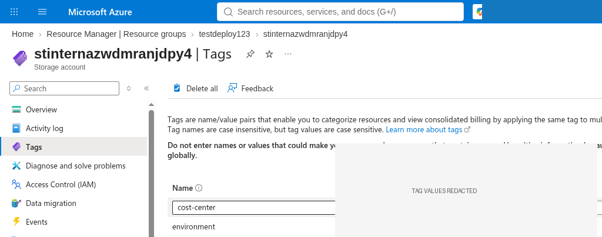
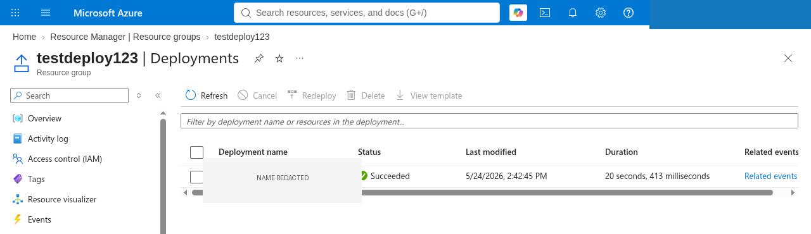
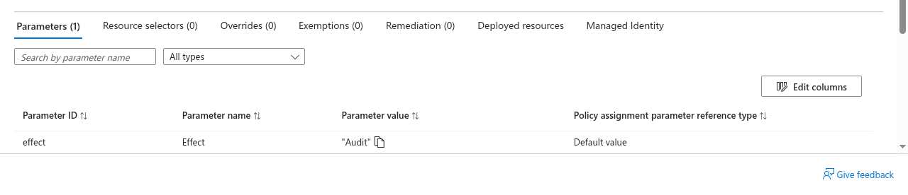

# Investigating Unauthorized Provisioning in a Shared Azure Tenant

Status: Draft — ready for review before publish.

## Scenario

Monday on-call: an intern with temporary Contributor access spun up a “test environment” over the weekend, skipped the usual standards, and left. My job was to reconstruct what landed in the subscription, decide whether it was a one-off mistake or a governance miss, and explain why existing controls did not stop it. I worked with Reader-style access only — inspect and document, no cleanup in place.

## Environment

- Platform: Mad Hat Labs (live multi-user Azure training tenant)
- Services: Resource groups, Tags, Resource Manager deployments, Azure Policy assignments
- Tools: Azure portal
- Access: Reader-style (view only; no create/update/delete performed for this write-up)
- Investigation window: September 2026 (lab stages already cleared during Chapter 1)

Honest framing: this is a shared training tenant, not a customer production environment. Identifiers that belong to other participants or reveal lab answer keys are redacted in the evidence below.

## Investigation

1. **Baseline the resource group landscape.** Opened Resource groups and compared names and regions. Most groups followed a consistent `rg-madhatlabs-*` pattern in Central US. One group broke that pattern and sat in East US — a clear naming and placement outlier worth treating as the provisional “what changed” object.

   

   *Figure 1 — Resource group list. Compliant groups share a naming pattern; one outlier does not. One operative-specific row is redacted.*

2. **Inspect the outlier for ownership signals.** Opened the outlier resource group, then a storage account inside it, and reviewed the Tags blade. Required-looking tag *names* were present (`cost-center`, `environment`), but the values are not published here (lab-sensitive). Tags told me someone had labeled the work, not that the labels met policy or that creation should have been allowed.

   

   *Figure 2 — Tags on a resource inside the outlier group. Tag values redacted.*

3. **Build a timeline from the deployment audit trail.** On the same resource group, opened Deployments. A single Succeeded deployment appeared with a last-modified timestamp and short duration. The deployment *name* is redacted in the screenshot; what matters for the write-up is that the blade gives a concrete “when this landed” anchor and a place to pivot into related events or the template later if needed.

   

   *Figure 3 — Resource group Deployments. Status Succeeded; deployment name redacted.*

4. **Ask why governance did not block the noncompliant name.** Searched policy assignments for naming-related policy and opened the assignment Parameters tab. The Effect parameter was set to `Audit`. Audit records noncompliance; it does not deny create. That matches what I saw on the ground: the naming standard existed, the outlier still existed, and nothing in my Reader path suggested a hard block had fired.

   

   *Figure 4 — Naming-related policy assignment Parameters. Effect = Audit (root-cause evidence for this case).*

## What broke / what surprised me

I initially assumed “there must not be a naming policy,” because a noncompliant resource group was sitting in the list. The surprising part was the opposite: a Naming Convention-style assignment *was* present and active, and the Effect was Audit. That flipped the story from “missing control” to “control in observe-only mode.” Early on I also wasted time looking at the wrong Azure directory (a personal lab tenant) before confirming I was in Mad Hat Labs — a reminder that directory context is part of the investigation, not a sidebar.

## Findings and recommendations

**Findings**

- An outlier resource group did not follow the prevailing naming (and region) pattern used by other groups in the subscription.
- Resources under that group carried tag *keys* that look like cost/environment metadata; values are withheld from this public write-up.
- The resource group Deployments blade showed a successful deployment suitable as a timeline start.
- A naming-related Azure Policy assignment was configured with Effect = Audit, which explains how a noncompliant name could still be created.

**Recommendations** (report-style; not applied in this training pass)

1. **Decide Audit vs Deny deliberately.** If the naming standard is meant to be mandatory for new resources, change Effect to Deny (or document an explicit, time-bound reason to keep Audit during a migration). Audit alone will not stop the next weekend deploy.
2. **Review temporary Contributor grants.** Confirm who still holds elevated create rights, for how long, and whether those grants should expire automatically after the assignment ends.
3. **Require tags at deployment time.** Prefer policy or pipeline checks that reject creates missing required tags, instead of relying on someone to fill them in after the fact.

No remediations were executed here (Reader-style scope). Verification of any Deny change would be a follow-up with change approval.

## What I learned

- Governance forensics is often “show me the Effect,” not “does a policy with the right name exist.”
- Naming outliers and wrong-region placements are useful first pivots when you only have Reader access.
- Deployments give you a timeline even when Activity Log is noisy or you do not yet know *who* to blame.
- I can now walk an interviewer through: spot the outlier → tags → deployment history → policy parameters → Audit vs Deny recommendation, without needing the lab’s answer key.

## Evidence links

| Stage | File | What it proves |
| --- | --- | --- |
| 1 | [stage1-rg-list.png](evidence/stage1-rg-list.png) | Naming/region outlier vs governed groups |
| 2 | [stage2-tags.png](evidence/stage2-tags.png) | Tag keys present; values redacted |
| 3 | [stage3-deployments.png](evidence/stage3-deployments.png) | Successful deployment as timeline anchor |
| 4 | [stage4-policy-effect-audit.png](evidence/stage4-policy-effect-audit.png) | Effect = Audit as root-cause evidence |

Omitted on purpose: lab flags, exact deployment names, tag values that reveal course answers, tenant/subscription IDs, and other participants’ identifiers.
